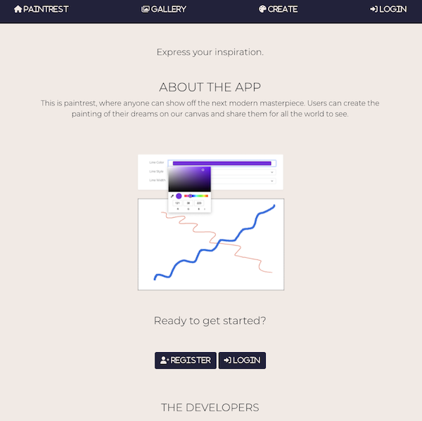
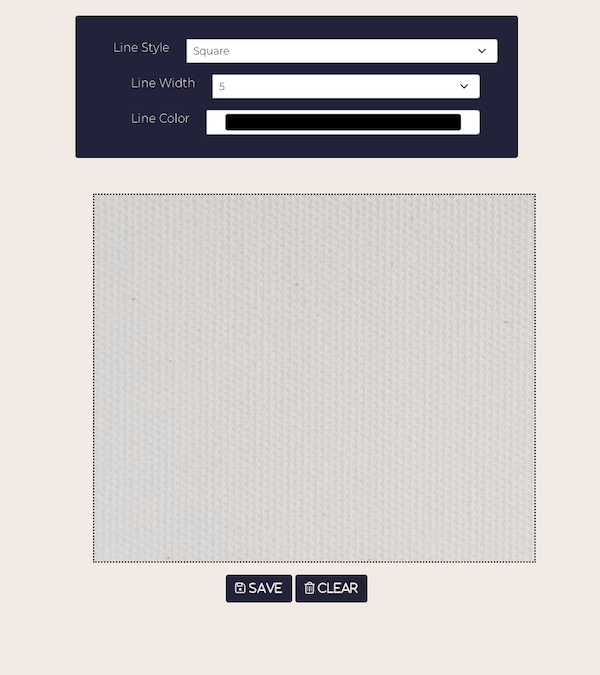
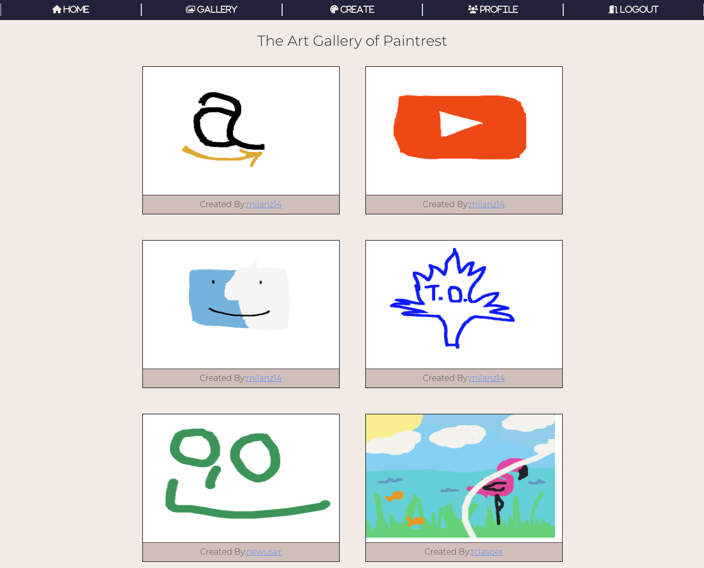

# Paintrest

**Purpose:** This project was created for a MintBeam hackathon competition. Contestants were given 1-week to create an application that allowed for users to draw on a canvas. Then it was up to us to take that idea and make something with it. -- Enjoy!

**Summary:** Paintrest is a platform that allows users to create and save thier artwork to share with the world!

## Reference Links

-   Matthew Landen (Developer): [Github] (https://github.com/landen1221) [Portfolio] (https://www.mattlanden.com/)
-   Milan Zagorac (Developer): [Github] https://github.com/milanz14 [Portfolio] (https://www.milanz.dev/)

-   API & Database Schema: https://github.com/milanz14/Paintrest-backend
-   Live site: https://paintrest.surge.sh/

## Technology Utilized

React (Router, FontAwesome, Bootstrap, Axios), Express, BCRYPT, JSON Web Tokens, Postgres, & Robust error handling

## Run Locally

Assure API is up and running (Found here: https://github.com/milanz14/Paintrest-backend)

Clone repository and enter directory of repo:

`git clone https://github.com/milanz14/Paintrest`

`cd Paintrest`

Install npm packages 
`npm init -y`

Install required packages 
`npm install`

Your project should be up and running, with a homescreen as seen below:

The app create screen allows users to paint on a canvas and upload their creations to their profile.

Users are also able to see the gallery of beautiful creations submitted by others.

The Front end of this is built with React with some FontAwesome and Bootstrap for styling.

If you have any creative ideas, submit a pull request for review explaining what the change is and what you think it would benefit the project.
