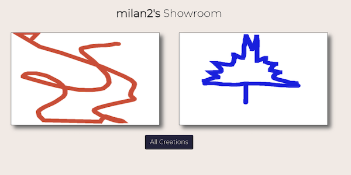

# Paintrest Project Front End

## This project was built for the Mintbean Hackathon, Nov 16-23, 2021
## This project was built by Milan Z and Matthew W.

### The project can be found here [https://milanz14.github.io/Paintrest/](https://milanz14.github.io/Paintrest/)

### The project starts on the beautiful landing pages which introduces the app

### Paintrest is a web app that allows users to paint on a canvas and upload their creations to their profile.

### Users can view the gallery of recent posts and view other users' posts.

User Gallery

The Art Show

### The Front end of this is built with React with some FontAwesome and Bootstrap for styling.

### To use this locally, fork the repository and start up your local server with `npm start`. The server will open on `localhost:3000`. If you have any creative ideas, submit a pull request for review explaining what the change is and what you think it would benefit the project.
