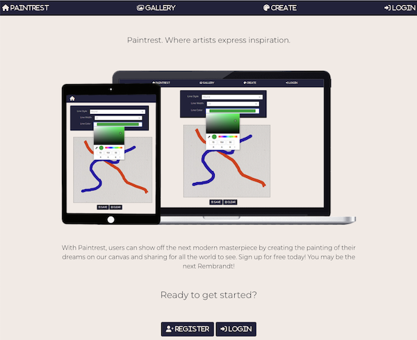
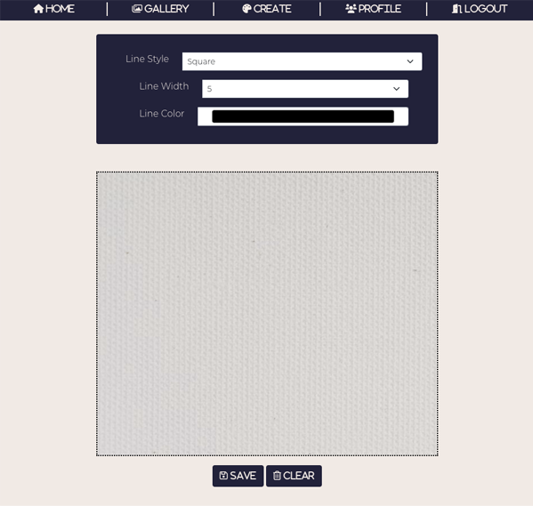

# Paintrest

**Purpose:** This project was created for a MintBean hackathon competition. Contestants were given 1-week to create an application that allowed for users to draw on a canvas. Then it was up to us to take that idea and make something with it. -- Enjoy!

**Summary:** Paintrest is a platform that allows users to create and save thier artwork to share with the world!

## Reference Links

-   Matthew Landen (Developer): [Github](https://github.com/landen1221) -- [Portfolio](https://www.mattlanden.com/)
-   Milan Zagorac (Developer): [Github](https://github.com/milanz14) -- [Portfolio](https://www.milanz.dev/)

-   Live site: https://paintrest.surge.sh/
-   Video Walkthrough: https://youtu.be/An6BQbhSCnw
-   API & Database Schema: https://github.com/milanz14/Paintrest-backend

## Technology Utilized

React (Router, FontAwesome, Bootstrap, Axios), Express, BCRYPT, JSON Web Tokens, Postgres, & Robust error handling

## Run Locally

Ensure API is up and running locally to utilize full functionality

-   Find those steps here: https://github.com/milanz14/Paintrest-backend

Clone repository and enter directory of repo: 
`git clone https://github.com/milanz14/Paintrest`

`cd Paintrest`

Initialize npm package & install required libraries: 
`npm init -y`
`npm install`

Set environment variable to call API: 
`REACT_APP_BASE_URL = 'http://localhost:3001'`

Run the app: 
`npm start`

Your project should be up and running, with a homescreen as seen below:

## Additional Screenshots

The create route allows users to paint on a canvas and upload their creations to their profile.

Users are also able to see the gallery of beautiful creations submitted by others.

## Additional Comments

If you have any creative ideas, submit a pull request for review explaining what the change is and what you think it would benefit the project.
